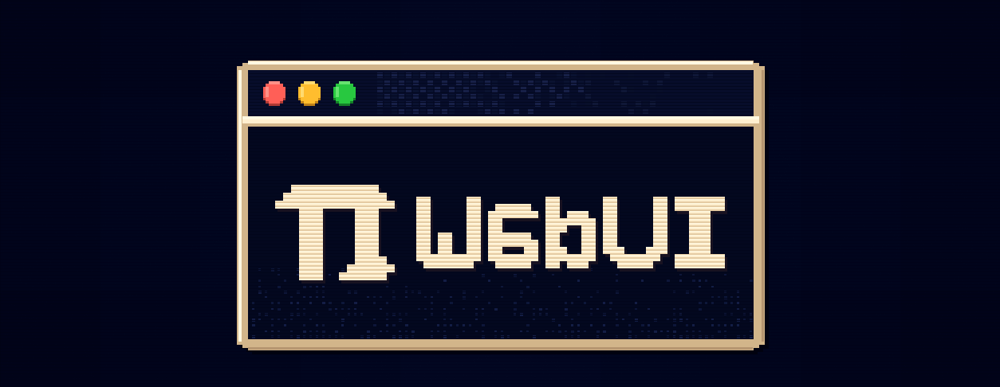
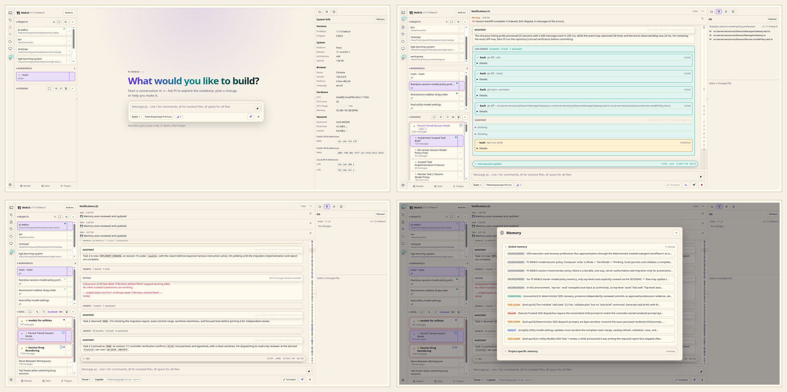

# PI WEBUI

[](https://github.com/hyperdreamer/pi-webui/actions/workflows/ci.yml)
[](https://www.npmjs.com/package/@hyperdreamer/pi-webui)
[](package.json)
[](LICENSE)

**PI WEBUI is a web UI for [Pi Coding Agent](https://github.com/earendil-works/pi/tree/main/packages/coding-agent) that keeps agent sessions running in real workspaces on your machine or server.**

Run agents where your code, tools, credentials, and build caches live. Supervise them from any browser.





## Why PI WEBUI?

Agentic development works better when the work environment is persistent.

PI WEBUI lets you:

- keep Pi Coding Agent sessions alive after browser disconnects;
- run agents inside real repositories and git worktrees;
- supervise multiple sessions in parallel;
- switch between laptop, phone, tablet, and desktop;
- use a server, workstation, or remote dev box as your agent runtime;
- navigate long conversations with the minimap and monitor live generation metrics;
- configure per-project models and skills to match each codebase;
- manage projects, workspaces, files, terminals, sessions, and remote machines from one web UI.

Your browser is the control surface. The work stays where it can keep running.

## Quick start

Requirements:

- Node.js 22.19.0 or newer
- npm
- Pi Coding Agent `>=0.82.1 <0.83`, configured for your user
- git and the development tools your agents need

Install PI WEBUI from npm or clone from GitHub:

```bash
# npm (recommended)
npm install -g @hyperdreamer/pi-webui
pi-webui

# or clone from GitHub
git clone https://github.com/hyperdreamer/pi-webui.git
cd pi-webui
npm install
./start.sh
```

Then open:

```text
http://localhost:8809
```

## Core model

PI WEBUI organizes work like this:

```text
Machine     a local or remote PI WEBUI runtime endpoint
Project     a folder on that machine
Workspace   a git worktree, or the project folder for non-git projects
Session     a Pi Coding Agent chat running inside a workspace
```

A typical flow:

1. On first run, PI WEBUI creates and opens `~/workspace`.
2. Choose a workspace or git worktree, or add a different project.
3. In an empty workspace, send a prompt; PI WEBUI creates its first session automatically.
4. Let the agent work.
5. Come back later from any browser.

## Remote-first development

PI WEBUI is designed for remote AI-driven development.

Instead of tying agent work to your laptop session, run PI WEBUI on a machine that stays available: a server, desktop, cloud VM, home lab machine, or remote dev box.

Use a private network, SSH tunnel, trusted reverse proxy, or federated PI WEBUI machine setup when accessing it remotely.

## Machines and fleets

PI WEBUI can register other PI WEBUI runtimes as remote machines. One browser-facing PI WEBUI instance can proxy projects, files, git state, sessions, terminals, activity, Pi package management, and selected-machine settings from trusted remote machines.

When a remote machine is selected, Settings tabs label their target. Pi packages, PI WEBUI plugin enablement, session daemon toggles, external file access, and upload defaults target the selected machine. Gateway/server settings such as host, port, allowed hosts, registered machines/tokens, and keyboard shortcuts stay local to the gateway/browser.

## Plugins

PI WEBUI supports trusted browser-side PI WEBUI plugins that can add actions, workspace panels, and workspace metadata. Plugins can also carry Pi package dependencies, and workspaces can configure per-workspace Pi packages.

Pi packages are managed through Pi's package manager or **Settings → Pi packages**. In a federated setup, the Pi packages panel targets the selected machine and labels where installs, updates, or removals will run. Use **Settings → PI WEBUI plugins** to enable or disable discovered browser plugins on the selected machine.

After installing, updating, or removing a Pi package, type `/reload` in each idle PI WEBUI session on that machine to refresh Pi runtime resources such as extensions, skills, prompt templates, themes, and context/system prompt files. Reload the browser page separately for newly discovered or changed PI WEBUI plugins.

## Configuration

Global config lives at:

```text
$PI_WEBUI_CONFIG
~/.config/pi-webui/config.json
```

Project-local PI WEBUI config lives at:

```text
<project>/.pi-webui/config.json
```

Common configuration includes host/port, path access, uploads, PI WEBUI plugin enablement, shortcuts, and session daemon options. In Settings, machine-affecting config targets the selected machine; gateway host/port/allowed-hosts, remote machine registration, tokens, and keyboard shortcuts stay local.

## Development

`start.sh` (a thin wrapper around `npm run dev`) starts the complete development stack. To run its processes separately:

```bash
npm run dev:sessiond
npm run dev:web
npm run dev:client
```

Validate changes with:

```bash
npm run verify
```

This repository also carries two opt-in agent skills as source, for deterministic
plan authoring and subagent-driven execution. They are not part of the published
package; see
[docs/optional-skills.md](https://github.com/hyperdreamer/pi-webui/blob/main/docs/optional-skills.md).

## Security model

PI WEBUI assumes trusted users, trusted repositories, and trusted server paths.

It is not a sandbox, permission system, or multi-tenant platform. Do not expose it directly to the public internet without a trusted network, firewall, VPN, SSH tunnel, or authenticated reverse proxy.

## Attribution

PI WEBUI is forked from [jmfederico/pi-web](https://github.com/jmfederico/pi-web), created by Federico Jaramillo Martinez, with additional code adapted from [agegr/pi-web](https://github.com/agegr/pi-web).

## License

MIT © 2026 Federico Jaramillo Martinez, agegr, and HyperDreamer. See [LICENSE](LICENSE).
